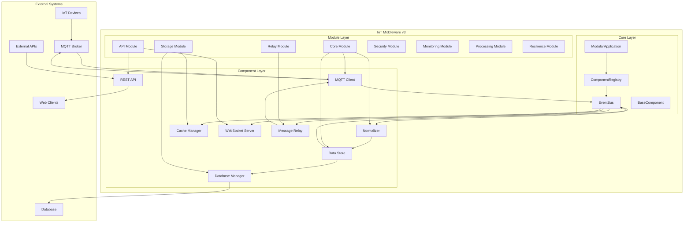

# IoT Middleware v3 - Modular Architecture Guide

Last updated: 2025-11-17 | Version: 1.0

**Related Documentation:**
- [Event System Guide](event.md) - Detailed event flow and handling
- [V5008 Message Format Guide](V5008-MQTT-Message-Format-and-Normalization-Guide.md) - V5008 device implementation
- [V6800 Message Format Guide](V6800-MQTT-Message-Format-and-Normalization-Guide.md) - V6800 device implementation

## Table of Contents

1. [Architecture Overview](#architecture-overview)
2. [System Architecture Diagram](#system-architecture-diagram)
3. [Core Components](#core-components)
4. [Module System](#module-system)
5. [Event-Driven Communication](#event-driven-communication)
6. [Component Lifecycle](#component-lifecycle)
7. [Data Flow](#data-flow)
8. [Configuration System](#configuration-system)
9. [Extensibility Points](#extensibility-points)
10. [Design Patterns](#design-patterns)
11. [Implementation Guidelines](#implementation-guidelines)
12. [Testing Strategies](#testing-strategies)
13. [Deployment Considerations](#deployment-considerations)
14. [Performance Guidelines](#performance-guidelines)
15. [Troubleshooting](#troubleshooting)

## Architecture Overview

IoT Middleware v3 is built on a modular, event-driven architecture that enables flexible deployment and easy extension. The system is composed of independent modules that communicate through a central event bus, ensuring loose coupling and high maintainability.

### Key Architectural Principles

1. **Modularity**: Each functional area is encapsulated in its own module
2. **Loose Coupling**: Components communicate through events, not direct references
3. **Configuration-Driven**: Behavior is controlled through configuration, not code changes
4. **Fault Tolerance**: System continues operating even when optional components fail
5. **Extensibility**: New functionality can be added without modifying existing code
6. **Observability**: Built-in monitoring and logging for all components
7. **Testability**: Each component can be tested in isolation

## System Architecture Diagram



### Component Interaction Diagram

```mermaid
sequenceDiagram
    participant Device as IoT Device
    participant MQTT as MQTT Broker
    participant Client as MQTT Client
    participant Bus as EventBus
    participant App as ModularApplication
    participant Norm as Normalizer
    participant Store as DataStore
    participant WS as WebSocket
    participant DB as Database
    
    Device->>MQTT: Publish message
    MQTT->>Client: Forward message
    Client->>Bus: Emit mqtt.message
    Bus->>App: Handle message
    App->>Norm: Normalize message
    Norm->>App: Return normalized
    App->>Store: Store message
    Store->>Bus: Emit data.stored
    App->>Bus: Emit message.processed
    Bus->>WS: Broadcast to clients
    Bus->>DB: Queue for storage

## Core Components

### 1. ModularApplication

The main application class that orchestrates all modules and components.

**Location**: `modules/ModularApplication.js`

**Key Responsibilities**:
- Initialize and coordinate all modules
- Handle high-level event routing
- Provide component access interface
- Manage application lifecycle

```javascript
class ModularApplication extends BaseComponent {
  constructor(options = {}) {
    super(options);
    this.configManager = null;
    this.componentRegistry = null;
    this.isInitialized = false;
  }
}
```

### 2. ComponentRegistry

Manages the registration, initialization, and lifecycle of all components.

**Location**: `modules/core/ComponentRegistry.js`

**Key Responsibilities**:
- Register component factories
- Initialize components in dependency order
- Manage component lifecycle
- Provide component access methods

```javascript
class ComponentRegistry {
  constructor(config, options = {}) {
    this.config = config;
    this.options = options;
    this.components = new Map();
    this.componentFactories = new Map();
    this.initializationOrder = [];
  }
}
```

### 3. EventBus

Central communication hub for all components using the publish-subscribe pattern.

**Location**: `modules/core/eventBus.js`

**Key Responsibilities**:
- Route events between components
- Maintain event listeners
- Provide event subscription/unsubscription

```javascript
class EventBus extends EventEmitter {
  constructor() {
    super();
    this.setMaxListeners(0); // Unlimited listeners
  }
}
```

### 4. BaseComponent

Abstract base class that all components must extend.

**Location**: `modules/core/BaseComponent.js`

**Key Responsibilities**:
- Provide common component interface
- Implement default lifecycle methods
- Offer utility functions for validation

```javascript
class BaseComponent {
  constructor(options = {}) {
    this.config = options.config || {};
    this.logger = logger;
    this.options = options;
  }
}
```

## Module System

The middleware is organized into 8 module groups, each with specific responsibilities:

### 1. Core Module (Required)

Essential components for basic functionality.

**Components**:
- **MQTT Client** (`modules/mqtt/MQTTClient.js`)
  - Connects to MQTT broker
  - Subscribes to device topics
  - Publishes messages

- **Normalizer** (`modules/normalizers/`)
  - Normalizes incoming messages
  - Manages device-specific parsers
  - Provides unified message format

- **Data Store** (`modules/storage/dataStore.js`)
  - In-memory storage for recent data
  - Provides fast access to latest readings
  - Manages data expiration

### 2. Storage Module (Optional)

Persistent storage and caching components.

**Components**:
- **Database** (`modules/database/DatabaseManager.js`)
  - MySQL database connection
  - Query execution
  - Transaction management

- **Cache** (`modules/storage/CacheManager.js`)
  - In-memory caching
  - TTL-based expiration
  - LRU eviction policy

- **Write Buffer** (`modules/storage/WriteBuffer.js`)
  - Batches database writes
  - Improves performance
  - Handles retry logic

### 3. API Module (Optional)

External access interfaces.

**Components**:
- **REST API** (`modules/api/RestAPIManager.js`)
  - HTTP endpoints for data access
  - Request validation
  - Response formatting

- **WebSocket** (`modules/api/WebSocketServer.js`)
  - Real-time data streaming
  - Client connection management
  - Message broadcasting

- **Webhook** (`modules/api/CallbackManager.js`)
  - HTTP callback notifications
  - Retry mechanism
  - Event filtering

### 4. Relay Module (Optional)

Message forwarding and distribution.

**Components**:
- **Message Relay** (`modules/mqtt/messageRelay.js`)
  - Forwards normalized messages
  - Topic transformation
  - Selective relay rules

### 5. Security Module (Optional)

Authentication and authorization features.

**Components**:
- **Auth Manager** (`modules/security/AuthManager.js`)
  - JWT token management
  - User authentication
  - Role-based access control

- **Input Validator** (`modules/security/InputValidator.js`)
  - Request validation
  - Data sanitization
  - Schema validation

### 6. Monitoring Module (Optional)

Observability and alerting capabilities.

**Components**:
- **Metrics Collector** (`modules/monitoring/MetricsCollector.js`)
  - Prometheus metrics
  - Performance tracking
  - Resource monitoring

- **Alert Manager** (`modules/monitoring/AlertManager.js`)
  - Rule-based alerting
  - Notification channels
  - Alert aggregation

### 7. Processing Module (Optional)

Data transformation and validation pipeline.

**Components**:
- **Data Validator** (`modules/processing/DataValidator.js`)
  - Schema validation
  - Data quality checks
  - Business rule validation

- **Data Transformer** (`modules/processing/DataTransformer.js`)
  - Message transformation
  - Data enrichment
  - Format conversion

### 8. Resilience Module (Optional)

Error handling and recovery mechanisms.

**Components**:
- **Circuit Breaker** (`modules/resilience/CircuitBreaker.js`)
  - Fault detection
  - Automatic failover
  - Recovery monitoring

- **Retry Manager** (`modules/resilience/RetryManager.js`)
  - Exponential backoff
  - Retry policies
  - Dead letter queue

## Event-Driven Communication

The system uses an event-driven architecture where components communicate through events published on the central event bus.

### Core Events

| Event Name | Description | Payload |
|------------|-------------|---------|
| `mqtt.message` | Raw MQTT message received | `{topic, message}` |
| `message.processed` | Message normalized and processed | Normalized message |
| `message.error` | Error in message processing | `{error, message}` |
| `data.stored` | Data stored in data store | `{deviceId, message}` |
| `relay.message` | Message to be relayed | `{topic, payload}` |

### Normalized Message Structure

All normalized messages follow this consistent structure:

```json
{
  "deviceId": "<device_id>",
  "deviceType": "V5008" | "V6800" | "G6000",
  "sensorType": "<sensor_type>",
  "msgType": "<message_type>",
  "modNum": <module_number>,
  "modId": "<module_id>",
  "ts": "<timestamp>",
  "payload": { ... },
  "meta": { ... }
}
```

**Field Descriptions:**
- `deviceId`: Unique identifier for the device
- `deviceType`: Device model (V5008, V6800, G6000)
- `sensorType`: Type of sensor (from MQTT topic)
- `msgType`: Normalized message type
- `modNum`: Module identifier (1-5 for V5008, 1-24 for V6800, null for G6000)
- `modId`: Module serial number
- `ts`: Message timestamp
- `payload`: Message-specific data
- `meta`: Metadata and original message info

### Event Flow Example

```javascript
// 1. MQTT Client receives message
eventBus.emit("mqtt.message", { topic, message });

// 2. Normalizer processes message
eventBus.on("mqtt.message", async (data) => {
  const normalized = normalizer.normalize(data.topic, data.message);
  if (normalized) {
    eventBus.emit("message.processed", normalized);
  }
});

// 3. Data Store stores message
eventBus.on("message.processed", (message) => {
  dataStore.handleMessage(message);
});

// 4. WebSocket broadcasts to clients
eventBus.on("message.processed", (message) => {
  websocket.broadcast(message);
});
```

## Component Lifecycle

All components follow a standardized lifecycle managed by the ComponentRegistry.

### Lifecycle States

1. **Registration**: Component factory is registered
2. **Instantiation**: Component instance is created
3. **Initialization**: Component's `initialize()` method is called
4. **Active**: Component is fully operational
5. **Shutdown**: Component's `shutdown()` method is called

### Initialization Order

Components are initialized in a specific order to handle dependencies:

1. Core components (mqtt, normalizer, dataStore)
2. Storage components (database, cache, writeBuffer)
3. API components (rest, websocket, webhook)
4. Relay components (messageRelay)
5. Optional modules (security, monitoring, processing, resilience)

### Component Implementation Example

```javascript
class MyComponent extends BaseComponent {
  constructor(options = {}) {
    super(options);
    // Component-specific initialization
  }

  async initialize() {
    // Validate required options
    this.validateOptions(['requiredOption']);
    
    // Component initialization logic
    this.logger.info("MyComponent initialized");
  }

  async shutdown() {
    // Cleanup resources
    this.logger.info("MyComponent shutting down");
    super.shutdown();
  }

  // Component-specific methods
  processMessage(message) {
    // Process incoming messages
  }
}
```

## Data Flow

The system processes IoT data through a well-defined pipeline:

### 1. Message Ingestion

```
MQTT Broker → MQTT Client → Event Bus
```

### 2. Normalization

```
Event Bus → Normalizer → Device Parser → Normalized Message
```

### 3. Processing

```
Normalized Message → Data Validator → Data Transformer → Processed Message
```

### 4. Distribution

```
Processed Message → Data Store
                 → Cache
                 → Write Buffer → Database
                 → WebSocket → Clients
                 → Message Relay → MQTT Broker
                 → Metrics Collector
```

### 5. Monitoring

```
All Events → Metrics Collector → Alert Manager → Notifications
```

## Configuration System

The system uses a hierarchical configuration system that supports:

### Configuration Sources

1. **Default Configuration**: Built-in defaults in `config/modular-config.json`
2. **Environment Variables**: Override settings using `${VAR_NAME:default}` syntax
3. **Runtime Configuration**: Dynamic updates through API

### Configuration Structure

```json
{
  "modules": {
    "moduleName": {
      "enabled": true,
      "description": "Module description",
      "components": {
        "componentName": {
          "enabled": true,
          "config": {
            // Component-specific configuration
          }
        }
      }
    }
  },
  "server": {
    "port": "${PORT:3000}",
    "host": "0.0.0.0"
  },
  "logger": {
    "level": "${LOG_LEVEL:info}"
  }
}
```

### Configuration Access

```javascript
// Get application configuration
const config = application.getConfig();

// Check if module is enabled
const isEnabled = application.isModuleEnabled("moduleName");

// Check if component is enabled
const isComponentEnabled = application.isComponentEnabled("moduleName", "componentName");
```

## Extensibility Points

The architecture provides several ways to extend functionality:

### 1. Adding New Device Types

Create a parser for the new device type:

```javascript
// modules/normalizers/myDeviceParser.js
function parse(topic, message, meta = {}) {
  // Parse device-specific message format
  return normalizedMessage;
}

module.exports = { parse };
```

Register the parser:

```javascript
// In NormalizerRegistry.js
this.registerParser("MYDEV", require("./myDeviceParser"), {
  version: "1.0.0",
  description: "Parser for MyDevice sensors"
});
```

### 2. Adding New Components

Create a component class:

```javascript
// modules/myModule/MyComponent.js
class MyComponent extends BaseComponent {
  async initialize() {
    // Initialize component
  }
  
  async shutdown() {
    // Cleanup resources
  }
}

module.exports = MyComponent;
```

Register the component:

```javascript
// In ComponentRegistry.js
registerDefaultFactories() {
  this.registerFactory("myComponent", () => require("../myModule/MyComponent"));
}
```

### 3. Adding Event Handlers

Subscribe to events in your component:

```javascript
async initialize() {
  super.initialize();
  
  // Subscribe to events
  eventBus.on("message.processed", this.handleMessage.bind(this));
}

handleMessage(message) {
  // Process the message
}
```

## Design Patterns

The architecture implements several design patterns:

### 1. Publisher-Subscriber Pattern

Components communicate through events without direct references.

### 2. Factory Pattern

Component instances are created through factories registered in the ComponentRegistry.

### 3. Singleton Pattern

Some components like DataStore use singleton pattern for shared state.

### 4. Observer Pattern

Components observe events and react to state changes.

### 5. Strategy Pattern

Different parsers implement different strategies for message normalization.

### 6. Circuit Breaker Pattern

Protects the system from cascading failures.

## Implementation Guidelines

### 1. Component Development

- Always extend `BaseComponent`
- Implement `initialize()` and `shutdown()` methods
- Use the provided logger for consistent logging
- Validate required options in `initialize()`
- Emit events for significant state changes

### 2. Error Handling

- Use try-catch blocks for async operations
- Emit error events for handling by other components
- Log errors with appropriate context
- Implement graceful degradation when possible

### 3. Configuration

- Use environment variables for deployment-specific settings
- Provide sensible defaults
- Validate configuration on startup
- Document all configuration options

### 4. Testing

- Unit test each component in isolation
- Mock external dependencies
- Test error conditions
- Verify event emissions

### 5. Performance

- Use batching for high-volume operations
- Implement caching where appropriate
- Monitor resource usage
- Optimize database queries

## Module Dependencies

```
Core Module
├── MQTT Client
├── Normalizer
└── Data Store

Storage Module
├── Database (depends on Core)
├── Cache (depends on Core)
└── Write Buffer (depends on Database, Core)

API Module
├── REST API (depends on Core, Storage)
├── WebSocket (depends on Core)
└── Webhook (depends on Core)

Relay Module
└── Message Relay (depends on Core, MQTT Client)

Security Module
├── Auth Manager (depends on Core)
└── Input Validator (depends on Core)

Monitoring Module
├── Metrics Collector (depends on Core)
└── Alert Manager (depends on Core, Metrics Collector)

Processing Module
├── Data Validator (depends on Core)
└── Data Transformer (depends on Core, Data Validator)

Resilience Module
├── Circuit Breaker (depends on Core)
└── Retry Manager (depends on Core)
```

## Best Practices

1. **Keep Components Focused**: Each component should have a single responsibility
2. **Use Events for Communication**: Avoid direct component-to-component calls
3. **Handle Failures Gracefully**: Implement proper error handling and recovery
4. **Log Appropriately**: Use consistent logging levels and formats
5. **Test Thoroughly**: Write unit and integration tests
6. **Document Everything**: Document configuration options, events, and APIs
7. **Version Your Changes**: Use semantic versioning for releases
8. **Monitor Performance**: Track key metrics and optimize bottlenecks

## Testing Strategies

### 1. Unit Testing Components

```javascript
// Example: Testing a component with mocked dependencies
const { expect } = require('chai');
const sinon = require('sinon');
const MyComponent = require('../modules/myModule/MyComponent');
const EventBus = require('../core/eventBus');

describe('MyComponent', () => {
  let myComponent;
  let eventBus;
  let logger;
  
  beforeEach(() => {
    // Mock dependencies
    eventBus = new EventBus();
    logger = {
      info: sinon.spy(),
      error: sinon.spy(),
      warn: sinon.spy()
    };
    
    // Create component with mocked dependencies
    myComponent = new MyComponent({
      eventBus,
      logger,
      config: { setting1: 'value1' }
    });
  });
  
  afterEach(() => {
    sinon.restore();
  });
  
  describe('initialize()', () => {
    it('should initialize successfully with valid config', async () => {
      await myComponent.initialize();
      expect(logger.info.calledWith('MyComponent initialized')).to.be.true;
    });
    
    it('should throw error with invalid config', async () => {
      myComponent.options.config = null;
      try {
        await myComponent.initialize();
        expect.fail('Should have thrown an error');
      } catch (error) {
        expect(error.message).to.include('Invalid configuration');
      }
    });
  });
  
  describe('event handling', () => {
    it('should handle message.processed events', () => {
      const testData = { deviceId: 'test', payload: {} };
      const handler = sinon.spy();
      
      eventBus.on('message.processed', handler);
      eventBus.emit('message.processed', testData);
      
      expect(handler.calledOnce).to.be.true;
      expect(handler.firstCall.args[0]).to.deep.equal(testData);
    });
  });
});
```

### 2. Integration Testing

```javascript
// Example: Testing component integration
const { expect } = require('chai');
const request = require('supertest');
const ModularApplication = require('../ModularApplication');

describe('Component Integration', () => {
  let app;
  
  before(async () => {
    // Initialize application with test configuration
    app = new ModularApplication({
      config: {
        modules: {
          core: { enabled: true },
          api: { enabled: true },
          storage: { enabled: true }
        }
      }
    });
    
    await app.initialize();
  });
  
  after(async () => {
    await app.shutdown();
  });
  
  describe('MQTT to API flow', () => {
    it('should process MQTT message and make it available via API', async () => {
      // Simulate MQTT message
      const mqttMessage = {
        topic: 'V5008Upload/test123/TemHum',
        message: Buffer.from('01EC3737BF0A1C30331B0B1C08330B0C000000000D000000000E000000000F0000000001012CC3', 'hex')
      };
      
      // Emit message to event bus
      app.eventBus.emit('mqtt.message', mqttMessage);
      
      // Wait for processing
      await new Promise(resolve => setTimeout(resolve, 100));
      
      // Verify data is available via API
      const response = await request(app.expressApp)
        .get('/api/devices/test123/data')
        .expect(200);
      
      expect(response.body).to.have.property('data');
      expect(response.body.data[0]).to.have.property('deviceId', 'test123');
    });
  });
});
```

### 3. Performance Testing

```javascript
// Example: Load testing for event processing
const { performance } = require('perf_hooks');
const EventBus = require('../core/eventBus');

describe('Performance Tests', () => {
  let eventBus;
  
  beforeEach(() => {
    eventBus = new EventBus();
  });
  
  it('should handle high-volume events without memory leaks', async () => {
    const eventCount = 10000;
    const listeners = [];
    
    // Add multiple listeners
    for (let i = 0; i < 10; i++) {
      listeners.push(() => {});
      eventBus.on('test.event', listeners[i]);
    }
    
    const startTime = performance.now();
    const initialMemory = process.memoryUsage().heapUsed;
    
    // Emit events
    for (let i = 0; i < eventCount; i++) {
      eventBus.emit('test.event', { id: i });
    }
    
    const endTime = performance.now();
    const finalMemory = process.memoryUsage().heapUsed;
    
    // Clean up
    listeners.forEach(listener => {
      eventBus.off('test.event', listener);
    });
    
    // Verify performance
    const duration = endTime - startTime;
    const memoryIncrease = finalMemory - initialMemory;
    
    expect(duration).to.be.below(1000); // Should complete within 1 second
    expect(memoryIncrease).to.be.below(50 * 1024 * 1024); // Less than 50MB increase
  });
});
```

### 4. End-to-End Testing

```javascript
// Example: E2E test with Docker containers
const { expect } = require('chai');
const mqtt = require('mqtt');
const WebSocket = require('ws');

describe('End-to-End Tests', () => {
  let mqttClient;
  let wsClient;
  
  before(async () => {
    // Connect to MQTT broker
    mqttClient = mqtt.connect('mqtt://localhost:1883');
    await new Promise(resolve => {
      mqttClient.on('connect', resolve);
    });
    
    // Connect to WebSocket
    wsClient = new WebSocket('ws://localhost:3000');
    await new Promise(resolve => {
      wsClient.on('open', resolve);
    });
  });
  
  after(async () => {
    mqttClient.end();
    wsClient.close();
  });
  
  it('should process message from MQTT to WebSocket', async () => {
    const messagePromise = new Promise(resolve => {
      wsClient.on('message', (data) => {
        resolve(JSON.parse(data.toString()));
      });
    });
    
    // Publish MQTT message
    mqttClient.publish('V5008Upload/test456/TemHum',
      Buffer.from('01EC3737BF0A1C30331B0B1C08330B0C000000000D000000000E000000000F0000000001012CC3', 'hex')
    );
    
    // Wait for WebSocket message
    const wsMessage = await messagePromise;
    
    expect(wsMessage).to.have.property('deviceId', 'test456');
    expect(wsMessage).to.have.property('deviceType', 'V5008');
    expect(wsMessage).to.have.property('sensorType', 'TemHum');
  });
});
```

## Deployment Considerations

### 1. Containerization

```dockerfile
# Dockerfile for IoT Middleware
FROM node:18-alpine

WORKDIR /app

# Copy package files
COPY package*.json ./

# Install dependencies
RUN npm ci --only=production

# Copy application code
COPY . .

# Create non-root user
RUN addgroup -g 1001 -S nodejs
RUN adduser -S nodejs -u 1001

# Change ownership
RUN chown -R nodejs:nodejs /app
USER nodejs

# Expose port
EXPOSE 3000

# Health check
HEALTHCHECK --interval=30s --timeout=3s --start-period=5s --retries=3 \
  CMD curl -f http://localhost:3000/health || exit 1

# Start application
CMD ["node", "server.js"]
```

### 2. Docker Compose Configuration

```yaml
# docker-compose.yml
version: '3.8'

services:
  iot-middleware:
    build: .
    ports:
      - "3000:3000"
    environment:
      - NODE_ENV=production
      - MQTT_BROKER_URL=mqtt://mosquitto:1883
      - DB_HOST=mysql
      - DB_USER=iotuser
      - DB_PASSWORD=iotpass
      - DB_NAME=iotdb
    depends_on:
      - mosquitto
      - mysql
    volumes:
      - ./config:/app/config
      - ./logs:/app/logs
    restart: unless-stopped
    
  mosquitto:
    image: eclipse-mosquitto:2
    ports:
      - "1883:1883"
      - "9001:9001"
    volumes:
      - ./mosquitto/config:/mosquitto/config
      - ./mosquitto/data:/mosquitto/data
      - ./mosquitto/log:/mosquitto/log
    restart: unless-stopped
    
  mysql:
    image: mysql:8
    environment:
      - MYSQL_ROOT_PASSWORD=rootpass
      - MYSQL_DATABASE=iotdb
      - MYSQL_USER=iotuser
      - MYSQL_PASSWORD=iotpass
    volumes:
      - mysql_data:/var/lib/mysql
      - ./config/schema.sql:/docker-entrypoint-initdb.d/schema.sql
    restart: unless-stopped
    
  redis:
    image: redis:7-alpine
    ports:
      - "6379:6379"
    volumes:
      - redis_data:/data
    restart: unless-stopped

volumes:
  mysql_data:
  redis_data:
```

### 3. Kubernetes Deployment

```yaml
# k8s-deployment.yaml
apiVersion: apps/v1
kind: Deployment
metadata:
  name: iot-middleware
  labels:
    app: iot-middleware
spec:
  replicas: 3
  selector:
    matchLabels:
      app: iot-middleware
  template:
    metadata:
      labels:
        app: iot-middleware
    spec:
      containers:
      - name: iot-middleware
        image: iot-middleware:latest
        ports:
        - containerPort: 3000
        env:
        - name: NODE_ENV
          value: "production"
        - name: MQTT_BROKER_URL
          value: "mqtt://mosquitto-service:1883"
        - name: DB_HOST
          value: "mysql-service"
        - name: REDIS_HOST
          value: "redis-service"
        resources:
          requests:
            memory: "256Mi"
            cpu: "250m"
          limits:
            memory: "512Mi"
            cpu: "500m"
        livenessProbe:
          httpGet:
            path: /health
            port: 3000
          initialDelaySeconds: 30
          periodSeconds: 10
        readinessProbe:
          httpGet:
            path: /ready
            port: 3000
          initialDelaySeconds: 5
          periodSeconds: 5
---
apiVersion: v1
kind: Service
metadata:
  name: iot-middleware-service
spec:
  selector:
    app: iot-middleware
  ports:
    - protocol: TCP
      port: 3000
      targetPort: 3000
  type: LoadBalancer
```

## Performance Guidelines

### 1. Memory Management

```javascript
// Memory monitoring and optimization
class MemoryManager {
  constructor() {
    this.memoryThreshold = 500 * 1024 * 1024; // 500MB
    this.monitoringInterval = 30000; // 30 seconds
    this.startMonitoring();
  }
  
  startMonitoring() {
    setInterval(() => {
      const memoryUsage = process.memoryUsage();
      
      if (memoryUsage.heapUsed > this.memoryThreshold) {
        this.handleHighMemoryUsage(memoryUsage);
      }
      
      // Log memory usage
      console.log('Memory Usage:', {
        heapUsed: `${Math.round(memoryUsage.heapUsed / 1024 / 1024)}MB`,
        heapTotal: `${Math.round(memoryUsage.heapTotal / 1024 / 1024)}MB`,
        external: `${Math.round(memoryUsage.external / 1024 / 1024)}MB`
      });
    }, this.monitoringInterval);
  }
  
  handleHighMemoryUsage(memoryUsage) {
    console.warn('High memory usage detected:', memoryUsage);
    
    // Force garbage collection if available
    if (global.gc) {
      global.gc();
    }
    
    // Clear caches
    if (this.cache) {
      this.cache.clear();
    }
    
    // Emit warning event
    eventBus.emit('system.memory.warning', memoryUsage);
  }
}
```

### 2. Connection Pooling

```javascript
// Database connection pool optimization
const mysql = require('mysql2/promise');

class DatabasePool {
  constructor(config) {
    this.pool = mysql.createPool({
      host: config.host,
      user: config.user,
      password: config.password,
      database: config.database,
      waitForConnections: true,
      connectionLimit: 20, // Adjust based on load
      queueLimit: 0,
      acquireTimeout: 60000,
      timeout: 60000,
      reconnect: true,
      idleTimeout: 300000 // 5 minutes
    });
    
    this.monitorPool();
  }
  
  async execute(sql, params) {
    const start = Date.now();
    try {
      const [results] = await this.pool.execute(sql, params);
      const duration = Date.now() - start;
      
      if (duration > 1000) {
        console.warn(`Slow query detected: ${duration}ms - ${sql}`);
      }
      
      return results;
    } catch (error) {
      console.error('Database error:', error);
      throw error;
    }
  }
  
  monitorPool() {
    setInterval(() => {
      const poolInfo = {
        totalConnections: this.pool._allConnections.length,
        freeConnections: this.pool._freeConnections.length,
        acquiringConnections: this.pool._acquiringConnections.length,
        waitingConnections: this.pool._connectionQueue.length
      };
      
      console.log('Connection Pool Status:', poolInfo);
      
      // Alert if pool is exhausted
      if (poolInfo.freeConnections === 0 && poolInfo.waitingConnections > 0) {
        console.warn('Connection pool exhausted, consider increasing limit');
      }
    }, 30000);
  }
}
```

### 3. Event Throttling

```javascript
// Event rate limiting for high-frequency events
class EventThrottler {
  constructor(maxEventsPerSecond = 1000) {
    this.maxEventsPerSecond = maxEventsPerSecond;
    this.eventCount = 0;
    this.lastReset = Date.now();
    this.droppedEvents = 0;
  }
  
  shouldAllowEvent() {
    const now = Date.now();
    const secondsSinceReset = (now - this.lastReset) / 1000;
    
    // Reset counter every second
    if (secondsSinceReset >= 1) {
      this.eventCount = 0;
      this.lastReset = now;
      
      if (this.droppedEvents > 0) {
        console.warn(`Dropped ${this.droppedEvents} events in the last second`);
        this.droppedEvents = 0;
      }
    }
    
    if (this.eventCount >= this.maxEventsPerSecond) {
      this.droppedEvents++;
      return false;
    }
    
    this.eventCount++;
    return true;
  }
  
  throttleEvent(eventBus, eventName, data) {
    if (this.shouldAllowEvent()) {
      eventBus.emit(eventName, data);
    } else {
      eventBus.emit('event.throttled', { eventName, data });
    }
  }
}
```

## Troubleshooting

### Common Issues and Solutions

#### 1. Component Initialization Failures

**Symptoms**: Components failing to initialize during startup

**Debugging Steps**:
```javascript
// Add detailed initialization logging
class ComponentRegistry {
  async initializeComponent(name, component) {
    const startTime = Date.now();
    
    try {
      console.log(`Initializing component: ${name}`);
      
      // Validate configuration
      this.validateComponentConfig(name, component);
      
      // Initialize component
      await component.initialize();
      
      const duration = Date.now() - startTime;
      console.log(`Component ${name} initialized successfully in ${duration}ms`);
      
      this.components.set(name, component);
    } catch (error) {
      const duration = Date.now() - startTime;
      console.error(`Failed to initialize component ${name} after ${duration}ms:`, error);
      
      // Continue with other components if optional
      if (component.optional) {
        console.warn(`Optional component ${name} failed to initialize, continuing...`);
        return;
      }
      
      throw error;
    }
  }
  
  validateComponentConfig(name, component) {
    const requiredOptions = component.requiredOptions || [];
    const missingOptions = requiredOptions.filter(opt =>
      !(opt in component.options)
    );
    
    if (missingOptions.length > 0) {
      throw new Error(`Component ${name} missing required options: ${missingOptions.join(', ')}`);
    }
  }
}
```

#### 2. Memory Leaks

**Symptoms**: Increasing memory usage over time

**Detection and Solution**:
```javascript
// Memory leak detection
class MemoryLeakDetector {
  constructor() {
    this.snapshots = [];
    this.threshold = 50 * 1024 * 1024; // 50MB
  }
  
  takeSnapshot() {
    const snapshot = {
      timestamp: Date.now(),
      memory: process.memoryUsage(),
      listeners: this.getListenerCounts()
    };
    
    this.snapshots.push(snapshot);
    
    // Keep only last 10 snapshots
    if (this.snapshots.length > 10) {
      this.snapshots.shift();
    }
    
    this.analyzeTrends();
  }
  
  getListenerCounts() {
    const counts = {};
    for (const [event, listeners] of eventBus._events) {
      counts[event] = Array.isArray(listeners) ? listeners.length : 1;
    }
    return counts;
  }
  
  analyzeTrends() {
    if (this.snapshots.length < 2) return;
    
    const current = this.snapshots[this.snapshots.length - 1];
    const previous = this.snapshots[this.snapshots.length - 2];
    
    const memoryIncrease = current.memory.heapUsed - previous.memory.heapUsed;
    
    if (memoryIncrease > this.threshold) {
      console.warn('Potential memory leak detected:', {
        memoryIncrease: `${Math.round(memoryIncrease / 1024 / 1024)}MB`,
        currentListeners: current.listeners,
        previousListeners: previous.listeners
      });
      
      // Identify potential listener leaks
      this.identifyListenerLeaks(current.listeners, previous.listeners);
    }
  }
  
  identifyListenerLeaks(current, previous) {
    for (const [event, count] of Object.entries(current)) {
      const previousCount = previous[event] || 0;
      if (count > previousCount + 5) { // Threshold for suspicious increase
        console.warn(`Potential listener leak for event ${event}: ${previousCount} -> ${count}`);
      }
    }
  }
}
```

#### 3. Event Processing Bottlenecks

**Symptoms**: Events being processed slowly or backing up

**Solution**:
```javascript
// Event processing monitoring
class EventProcessingMonitor {
  constructor() {
    this.processingTimes = new Map();
    this.queueSizes = new Map();
    this.startMonitoring();
  }
  
  monitorEvent(eventName, processingFn) {
    return async (...args) => {
      const startTime = process.hrtime.bigint();
      
      try {
        const result = await processingFn(...args);
        
        const endTime = process.hrtime.bigint();
        const duration = Number(endTime - startTime) / 1000000; // Convert to ms
        
        this.recordProcessingTime(eventName, duration);
        
        // Alert on slow events
        if (duration > 100) {
          console.warn(`Slow event processing: ${eventName} took ${duration.toFixed(2)}ms`);
        }
        
        return result;
      } catch (error) {
        console.error(`Error processing event ${eventName}:`, error);
        throw error;
      }
    };
  }
  
  recordProcessingTime(eventName, duration) {
    if (!this.processingTimes.has(eventName)) {
      this.processingTimes.set(eventName, []);
    }
    
    const times = this.processingTimes.get(eventName);
    times.push(duration);
    
    // Keep only last 100 measurements
    if (times.length > 100) {
      times.shift();
    }
    
    // Calculate statistics
    const avg = times.reduce((a, b) => a + b, 0) / times.length;
    const max = Math.max(...times);
    
    if (avg > 50 || max > 500) {
      console.warn(`Event ${eventName} performance issue: avg=${avg.toFixed(2)}ms, max=${max.toFixed(2)}ms`);
    }
  }
}
```

This architecture guide provides a comprehensive understanding of the IoT Middleware v3 system, including implementation examples, testing strategies, deployment considerations, and troubleshooting guidance. For specific implementation details, refer to the source code and inline documentation.