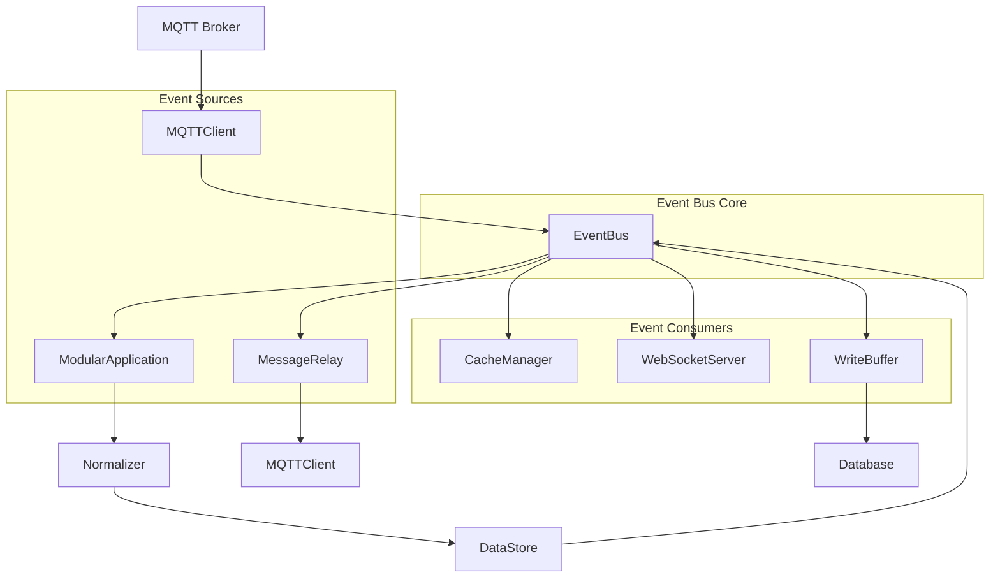

# Event System in IoT Middleware v3

Last updated: 2025-11-17 | Version: 1.0

**Related Documentation:**
- [Modular Architecture Guide](MODULAR_ARCHITECTURE.md) - Overview of the system architecture
- [V5008 Message Format Guide](V5008-MQTT-Message-Format-and-Normalization-Guide.md) - V5008 device-specific events
- [V6800 Message Format Guide](V6800-MQTT-Message-Format-and-Normalization-Guide.md) - V6800 device-specific events

This document describes the event flow architecture in the IoT Middleware v3 project, including where events are created, sent, listened for, and handled.

## Table of Contents

1. [Core Event Infrastructure](#core-event-infrastructure)
2. [Event Flow Architecture](#event-flow-architecture)
3. [Event Flow Diagram](#event-flow-diagram)
4. [Error Handling Patterns](#error-handling-patterns)
5. [Performance Considerations](#performance-considerations)
6. [Troubleshooting](#troubleshooting)
7. [Event Types and Data Flow](#event-types-and-data-flow)
8. [Complete Message Flow Example](#complete-message-flow-example)
9. [Event-Driven Benefits](#event-driven-benefits)
10. [Configuration and Customization](#configuration-and-customization)

## Core Event Infrastructure

### EventBus Module (`modules/core/eventBus.js`)

The event system is built around a centralized EventBus that extends Node.js's EventEmitter:

- **Singleton Pattern**: The EventBus is implemented as a singleton to ensure all components use the same event instance
- **Unlimited Listeners**: Sets `setMaxListeners(0)` to allow unlimited event listeners
- **Core Methods**:
  - `publish(event, data)` - Emits an event with data
  - `subscribe(event, handler)` - Registers an event listener
  - `subscribeOnce(event, handler)` - Registers a one-time event listener
  - `unsubscribe(event, handler)` - Removes an event listener

## Event Flow Architecture

### Event Flow Diagram



### 1. Event Creation Points

#### MQTT Module (`modules/mqtt/MQTTClient.js`)
- **Event**: `mqtt.message`
- **Trigger**: When an MQTT message is received on a subscribed topic
- **Location**: In the `message` event handler of the MQTT client
- **Code**: `eventBus.emit("mqtt.message", { topic, message })`

#### Message Relay Module (`modules/mqtt/messageRelay.js`)
- **Event**: `relay.message`
- **Trigger**: When a message needs to be relayed to another MQTT topic
- **Location**: In the `relayMessage` method
- **Code**: `eventBus.emit("relay.message", { topic: transformed.topic, payload: transformed.payload })`

#### Modular Application (`modules/ModularApplication.js`)
- **Events**: `message.processed`, `message.error`
- **Trigger**: After message processing or when errors occur
- **Location**: In message handling methods
- **Code**: 
  - `eventBus.emit("message.processed", normalized)`
  - `eventBus.emit("message.error", { error, data })`

### 2. Event Registry and Listener Registration

#### ComponentRegistry (`modules/core/ComponentRegistry.js`)
The ComponentRegistry is responsible for setting up event listeners during component initialization:

- **MQTT Component**: Subscribes to MQTT topics and emits `mqtt.message` events
- **WebSocket Component**: Subscribes to `message.processed` events for broadcasting
- **Cache Component**: Subscribes to `message.processed` events to update cache

#### ModularApplication (`modules/ModularApplication.js`)
The main application registers core event listeners in `setupEventListeners()`:

```javascript
// Handle MQTT messages
eventBus.on("mqtt.message", this.handleMqttMessage.bind(this));

// Handle processed messages
eventBus.on("message.processed", this.handleProcessedMessage.bind(this));

// Handle message errors
eventBus.on("message.error", this.handleMessageError.bind(this));

// Handle relay messages
eventBus.on("relay.message", this.handleRelayMessage.bind(this));
```

### 3. Event Handling Locations

#### ModularApplication (`modules/ModularApplication.js`)
- **`handleMqttMessage(data)`**: Processes incoming MQTT messages, normalizes them, and stores them
- **`handleProcessedMessage(message)`**: Handles processed messages by updating cache, write buffer, and broadcasting to WebSocket clients
- **`handleMessageError(data)`**: Handles message processing errors
- **`handleRelayMessage(relayData)`**: Publishes relay messages to MQTT topics

#### WebSocketServer (`modules/api/WebSocketServer.js`)
- **`broadcast(message)`**: Broadcasts processed messages to all connected WebSocket clients
- **Registration**: `eventBus.on("message.processed", this.broadcast.bind(this))`

#### MessageRelay (`modules/mqtt/messageRelay.js`)
- **`handleMessage(message)`**: Processes messages and applies relay rules
- **Registration**: `eventBus.on("message.processed", this.handleMessage.bind(this))`

#### CacheManager (`modules/storage/CacheManager.js`)
- **Cache Update**: Updates cache with processed messages
- **Registration**: `eventBus.on("message.processed", (message) => { instance.set(message.deviceId, message); })`

## Event Types and Data Flow

### 1. `mqtt.message` Event
- **Purpose**: Signals arrival of a new MQTT message
- **Data Structure**: `{ topic, message }`
- **Flow**: MQTTClient → EventBus → ModularApplication.handleMqttMessage

### 2. `message.processed` Event
- **Purpose**: Signals that a message has been normalized and processed
- **Data Structure**: Normalized message object with deviceId, deviceType, payload, etc.
- **Flow**: ModularApplication → EventBus → [CacheManager, WebSocketServer, MessageRelay, WriteBuffer]

### 3. `message.error` Event
- **Purpose**: Signals an error in message processing
- **Data Structure**: `{ error, data }` or `{ error, message }`
- **Flow**: Various components → EventBus → ModularApplication.handleMessageError

### 4. `relay.message` Event
- **Purpose**: Signals that a message needs to be relayed to another MQTT topic
- **Data Structure**: `{ topic, payload }`
- **Flow**: MessageRelay → EventBus → ModularApplication.handleRelayMessage → MQTTClient

### 5. `relay.success` and `relay.error` Events
- **Purpose**: Signals success or failure of message relay operations
- **Data Structure**: `{ sourceTopic, targetTopic }` or `{ error, sourceTopic }`
- **Flow**: MessageRelay → EventBus (for monitoring/logging)

## Complete Message Flow Example

1. **MQTT Message Arrival**
   - MQTTClient receives message on subscribed topic
   - Emits `mqtt.message` event with `{ topic, message }`

2. **Message Processing**
   - ModularApplication.handleMqttMessage receives the event
   - Normalizes the message using the normalizer module
   - Stores the normalized message in dataStore
   - Emits `message.processed` event with normalized data

3. **Message Distribution**
   - CacheManager receives `message.processed` and updates cache
   - WebSocketServer receives `message.processed` and broadcasts to clients
   - MessageRelay receives `message.processed` and applies relay rules
   - WriteBuffer receives `message.processed` and queues for database storage

4. **Message Relay (if applicable)**
   - MessageRelay emits `relay.message` event
   - ModularApplication.handleRelayMessage receives the event
   - MQTTClient publishes the relayed message to the target topic

## Error Handling Patterns

### 1. Event-Level Error Handling

```javascript
// Example of robust event handling with error boundaries
eventBus.on("mqtt.message", async (data) => {
  try {
    await this.handleMqttMessage(data);
  } catch (error) {
    // Emit error event for centralized handling
    eventBus.emit("message.error", {
      error: error.message,
      data,
      timestamp: new Date().toISOString(),
      source: "ModularApplication.handleMqttMessage"
    });
    
    // Log with context
    this.logger.error(`Failed to process MQTT message: ${error.message}`, {
      topic: data.topic,
      messageId: data.messageId,
      stack: error.stack
    });
  }
});
```

### 2. Component-Level Error Handling

```javascript
// BaseComponent error handling pattern
class BaseComponent {
  emitEvent(eventName, data) {
    try {
      eventBus.emit(eventName, data);
    } catch (error) {
      this.logger.error(`Failed to emit event ${eventName}: ${error.message}`);
      // Implement retry logic or fallback behavior
      this.handleEventEmissionError(eventName, data, error);
    }
  }
  
  handleEventEmissionError(eventName, data, error) {
    // Override in subclasses for custom error handling
  }
}
```

### 3. Circuit Breaker Pattern for Event Processing

```javascript
class EventCircuitBreaker {
  constructor(threshold = 5, timeout = 60000) {
    this.failureCount = 0;
    this.failureThreshold = threshold;
    this.timeout = timeout;
    this.state = 'CLOSED'; // CLOSED, OPEN, HALF_OPEN
    this.lastFailureTime = null;
  }
  
  async execute(operation) {
    if (this.state === 'OPEN') {
      if (Date.now() - this.lastFailureTime > this.timeout) {
        this.state = 'HALF_OPEN';
      } else {
        throw new Error('Circuit breaker is OPEN');
      }
    }
    
    try {
      const result = await operation();
      this.onSuccess();
      return result;
    } catch (error) {
      this.onFailure();
      throw error;
    }
  }
  
  onSuccess() {
    this.failureCount = 0;
    this.state = 'CLOSED';
  }
  
  onFailure() {
    this.failureCount++;
    this.lastFailureTime = Date.now();
    if (this.failureCount >= this.failureThreshold) {
      this.state = 'OPEN';
    }
  }
}
```

## Performance Considerations

### 1. Event Processing Optimization

```javascript
// Batch event processing for high-volume scenarios
class EventBatchProcessor {
  constructor(batchSize = 100, flushInterval = 1000) {
    this.batchSize = batchSize;
    this.flushInterval = flushInterval;
    this.eventQueue = [];
    this.timer = null;
  }
  
  addEvent(event) {
    this.eventQueue.push(event);
    
    if (this.eventQueue.length >= this.batchSize) {
      this.flush();
    } else if (!this.timer) {
      this.timer = setTimeout(() => this.flush(), this.flushInterval);
    }
  }
  
  flush() {
    if (this.timer) {
      clearTimeout(this.timer);
      this.timer = null;
    }
    
    if (this.eventQueue.length === 0) return;
    
    const batch = this.eventQueue.splice(0);
    this.processBatch(batch);
  }
  
  processBatch(events) {
    // Process events in batch for better performance
    events.forEach(event => {
      eventBus.emit(event.name, event.data);
    });
  }
}
```

### 2. Memory Management

```javascript
// Event listener cleanup pattern
class ManagedEventSubscriber {
  constructor(eventBus) {
    this.eventBus = eventBus;
    this.subscriptions = new Map();
  }
  
  subscribe(event, handler) {
    const wrappedHandler = (...args) => {
      try {
        handler(...args);
      } catch (error) {
        console.error(`Error in event handler for ${event}:`, error);
      }
    };
    
    this.eventBus.on(event, wrappedHandler);
    this.subscriptions.set(event, wrappedHandler);
  }
  
  unsubscribe(event) {
    const handler = this.subscriptions.get(event);
    if (handler) {
      this.eventBus.off(event, handler);
      this.subscriptions.delete(event);
    }
  }
  
  unsubscribeAll() {
    for (const [event, handler] of this.subscriptions) {
      this.eventBus.off(event, handler);
    }
    this.subscriptions.clear();
  }
}
```

### 3. Event Priority and Throttling

```javascript
// Priority-based event processing
class PriorityEventQueue {
  constructor() {
    this.queues = {
      high: [],
      medium: [],
      low: []
    };
    this.processing = false;
  }
  
  enqueue(event, priority = 'medium') {
    this.queues[priority].push(event);
    if (!this.processing) {
      this.process();
    }
  }
  
  async process() {
    this.processing = true;
    
    while (this.hasEvents()) {
      // Process high priority first, then medium, then low
      for (const priority of ['high', 'medium', 'low']) {
        const event = this.queues[priority].shift();
        if (event) {
          await this.processEvent(event);
          break;
        }
      }
    }
    
    this.processing = false;
  }
  
  hasEvents() {
    return Object.values(this.queues).some(queue => queue.length > 0);
  }
  
  async processEvent(event) {
    // Process the event
    await event.handler(event.data);
  }
}
```

## Troubleshooting

### Common Event System Issues

#### 1. Event Not Received

**Symptoms**: Event listeners not being triggered despite events being emitted.

**Debugging Steps**:
```javascript
// Add event bus debugging
const originalEmit = eventBus.emit;
eventBus.emit = function(event, ...args) {
  console.log(`Event emitted: ${event}`, args);
  return originalEmit.call(this, event, ...args);
};

// Check listener count
console.log(`Listeners for mqtt.message: ${eventBus.listenerCount('mqtt.message')}`);
```

**Common Causes**:
- Event name mismatch (typo or case sensitivity)
- Listener not properly registered
- Component not initialized
- Event emitted before listener registration

#### 2. Memory Leaks from Event Listeners

**Symptoms**: Increasing memory usage over time, especially with component recreation.

**Debugging Steps**:
```javascript
// Monitor listener counts
setInterval(() => {
  console.log('Event listener counts:');
  console.log(`mqtt.message: ${eventBus.listenerCount('mqtt.message')}`);
  console.log(`message.processed: ${eventBus.listenerCount('message.processed')}`);
}, 30000);

// Check for leaked listeners
eventBus.on('newListener', (event, listener) => {
  console.log(`New listener added for: ${event}`);
});
```

**Solutions**:
- Implement proper cleanup in component shutdown
- Use weak references for temporary listeners
- Monitor listener counts in production

#### 3. Event Storm Conditions

**Symptoms**: System becoming unresponsive under high load.

**Debugging Steps**:
```javascript
// Add event rate limiting
const eventCounts = {};
const eventRates = {};

setInterval(() => {
  for (const [event, count] of Object.entries(eventCounts)) {
    eventRates[event] = count;
    if (count > 1000) { // Threshold for event storm detection
      console.warn(`High event rate detected for ${event}: ${count}/sec`);
    }
  }
  Object.keys(eventCounts).forEach(key => delete eventCounts[key]);
}, 1000);

const originalEmit = eventBus.emit;
eventBus.emit = function(event, ...args) {
  eventCounts[event] = (eventCounts[event] || 0) + 1;
  return originalEmit.call(this, event, ...args);
};
```

#### 4. Event Ordering Issues

**Symptoms**: Events processed out of expected order.

**Debugging Steps**:
```javascript
// Add sequence tracking
let sequenceNumber = 0;

const originalEmit = eventBus.emit;
eventBus.emit = function(event, ...args) {
  const seq = ++sequenceNumber;
  console.log(`Event #${seq}: ${event}`);
  
  // Add sequence to event data
  if (args[0] && typeof args[0] === 'object') {
    args[0].sequenceNumber = seq;
  }
  
  return originalEmit.call(this, event, ...args);
};
```

### Performance Monitoring

```javascript
// Event performance monitoring
class EventPerformanceMonitor {
  constructor() {
    this.metrics = new Map();
  }
  
  startTiming(event) {
    this.metrics.set(event, process.hrtime.bigint());
  }
  
  endTiming(event) {
    const startTime = this.metrics.get(event);
    if (startTime) {
      const endTime = process.hrtime.bigint();
      const duration = Number(endTime - startTime) / 1000000; // Convert to ms
      
      console.log(`Event ${event} processed in ${duration.toFixed(2)}ms`);
      this.metrics.delete(event);
      
      // Alert on slow events
      if (duration > 100) {
        console.warn(`Slow event detected: ${event} took ${duration.toFixed(2)}ms`);
      }
    }
  }
}

// Usage in event handlers
const monitor = new EventPerformanceMonitor();

eventBus.on("message.processed", (message) => {
  monitor.startTiming("message.processed");
  // Process message
  monitor.endTiming("message.processed");
});
```

## Event-Driven Benefits

1. **Decoupling**: Components communicate through events without direct dependencies
2. **Scalability**: New components can easily subscribe to existing events
3. **Flexibility**: Event handlers can be added/removed dynamically
4. **Testability**: Components can be tested in isolation with mock events
5. **Maintainability**: Clear separation of concerns between event producers and consumers
6. **Resilience**: System can continue operating even when some components fail
7. **Observability**: Event flow provides natural monitoring and debugging points

## Configuration and Customization

Event subscriptions and handling can be configured through:
- **Component Configuration**: Enable/disable components in `config/modular-config.json`
- **Event Handlers**: Add custom handlers in component initialization
- **Relay Rules**: Configure message relay patterns in the messageRelay module options
- **Performance Tuning**: Adjust batch sizes, timeouts, and circuit breaker thresholds
- **Monitoring**: Configure event metrics and alerting thresholds

### Configuration Example

```json
{
  "eventSystem": {
    "maxListeners": 100,
    "batchProcessing": {
      "enabled": true,
      "batchSize": 50,
      "flushInterval": 500
    },
    "circuitBreaker": {
      "enabled": true,
      "failureThreshold": 5,
      "timeout": 60000
    },
    "monitoring": {
      "enabled": true,
      "slowEventThreshold": 100,
      "eventStormThreshold": 1000
    }
  }
}
```

This event-driven architecture provides a robust foundation for the IoT middleware, allowing for flexible message processing and component interaction with proper error handling, performance optimization, and troubleshooting capabilities.